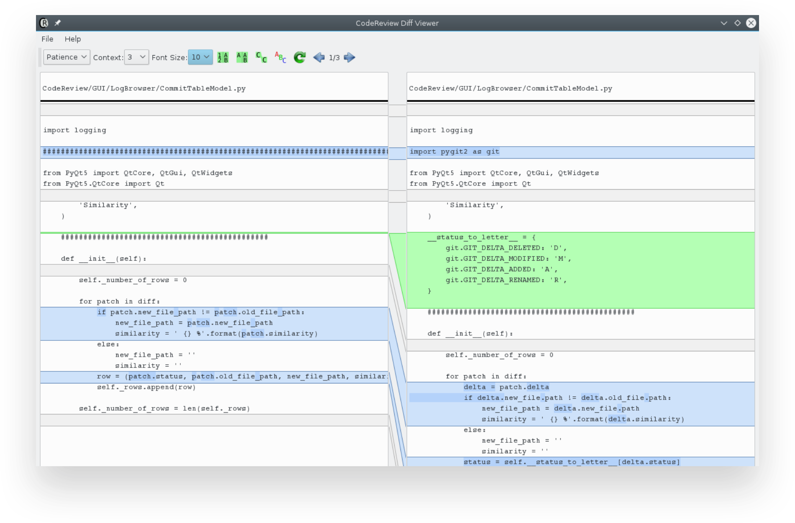
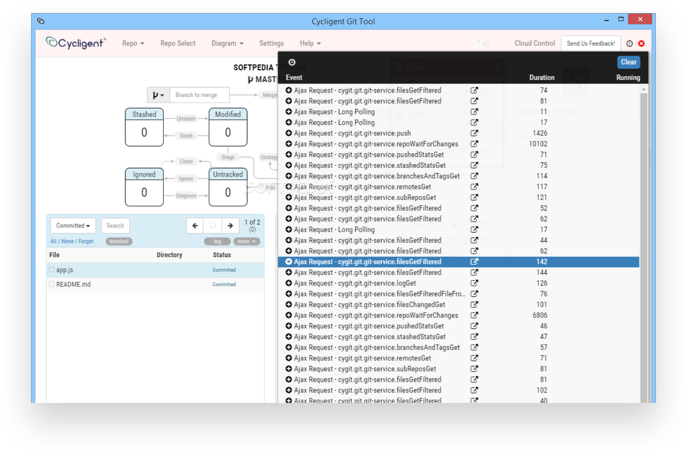

# Linux

### Code Review

|  |  |
| :--- | :--- |
| Description | CodeReview is a Git GUI tool to perform code review (Diff Viewer) written in Python3 and Qt5. |
| Price | Free |
| Platform | Linux, macOS, Windows |
| Site | [http://fabricesalvaire.github.io/CodeReview/](http://fabricesalvaire.github.io/CodeReview/) |

### Cycligent

|  |  |
| :--- | :--- |
| Description | Cross-platform, Actionable, Graphical Git Dashboard |
| Price | Free |
| Platform | Linux, macOS, Windows |
| Site | [https://www.cycligent.com/git-tool](https://www.cycligent.com/git-tool) |