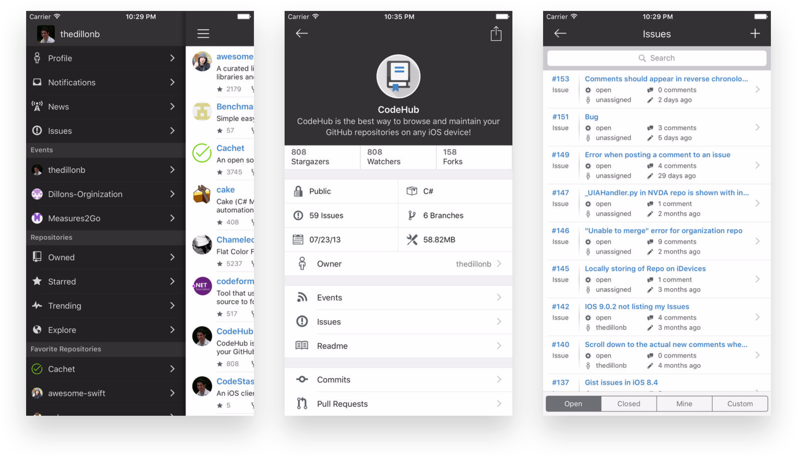

# Android

### CodeHub

|  |  |
| :--- | :--- |
| Description | CodeHub is the most complete, unofficial, client for GitHub on the iOS platform. The project is designed in C# using the Xamarin.iOS product with the expectation that it will one day operate on all major mobile platforms. CodeHub is not, in any way, affiliated with GitHub, Inc. |
| Price | Free |
| Platform | iOS |
| Site | [http://codehub-app.com/](http://codehub-app.com/) |